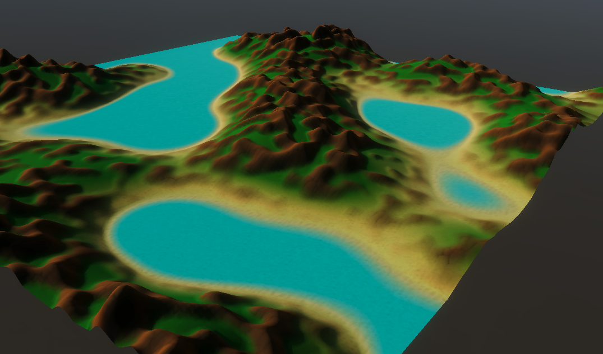

First year university project to prove you can use the unity game engine.
This was way overboard as it was a multi-threaded terrain generator with textures and texture blending which you could modify during runtime.
I was able to achieve a 86/100 on the module with this, with a first being 70/100

# gam102-1-2202796 In-Engine Diorama
Challenge: Digital Fascinator
# Proposal
I intend to create a terrain landscape generator using a hydraulic erosion algorithm from the internet. This algorithm will be applied to a height map-based terrain generator.
The minimum viable product I wish to create is single displayed area which the user can modify using in fascinator UI. The generation should not freeze the fascinator but does not need to generate instantly.
The user should also be able to fly around the area.
The terrain will use a custom shader to provide colour to it at different heights.
 
 
 
### Main Task Breakdown
-	Create a height map terrain generator using an algorithm or number of algorithms from the internet.
-	Create in game UI to change the generation settings
-	Create a first-person player that can move around the scene to view the map.
-	Create a height map layering system to combine multiple heightmaps into one, to allow for varied terrain types in the same map (flat ground, small hills, mountains)
-	Apply hydraulic erosion to some of the height map layers to create more natural looking mountains
### Technology
The fascinator will be using packages from Unity’s DOTS stack (Data Oriented Tech Stack)
-	The Entity Component System (Preview Package [0.51.1-preview.21])
-	C# Jobs System (released)
-	The Burst Compiler (released)
I have experience using all of the above to improve performance of large simulations like terrain generation.
# Stretch goals
## Goal 1
I wish to create a glass building above the large area, where the player can be in, within this building are glass cabinets with scaled down and randomly generated terrain rotating in place and slowly transitioning between different randomly generated height maps.
The user can choose to select one of the cabinets, freezing the transitioning in the current state, and sending that state to the full-scale area. The user can then go and fly around to look closer at the map or modify it.
### Breakdown
-	Map transitioning (smoothly transitioning between height maps)
-	Full map instancing (the shader and material must only use data from the mesh to determine colour, no global data set from a script)
-	Increased optimisation to allow the random generation to be seamless
## Goal 2
Add map detailing
 (trees, bushes, flowers, grass)
### Breakdown
-	Height map generator must produce information about where to place map details depending on height and information from the erosion system.
## Goal 3
Create a water shader to allow lake formations to be created
### Breakdown
-	Modify the generator to randomly add lake areas
-	Create a mesh generator to display the lakes
-	Create an animated water shader for the lakes

# Acknowledgement
## Art
* Terrain pattern Textures take from "FREE Stylized PBR Textures Pack"
  * https://assetstore.unity.com/packages/2d/textures-materials/free-stylized-pbr-textures-pack-111778
* Air Ship Textures take from "FREE Stylized PBR Textures Pack" and "Yughues Free Metal Materials" 
  * https://assetstore.unity.com/packages/2d/textures-materials/free-stylized-pbr-textures-pack-111778
  * https://assetstore.unity.com/packages/2d/textures-materials/metals/yughues-free-metal-materials-12949
* Both textures packs are free under the Unity Extension Asset licience granting free use per user.
## Tech
* Original Noise Generation alogrithims were written by Sebastian Lague
  * Released under the MIT License https://github.com/SebLague/Procedural-Planets
* Original Hydraulic Erosion alogrithim was written by Sebastian Lague
  * Released under the MIT License https://github.com/SebLague/Hydraulic-Erosion
* These algorithims are clearly stated and sourced in the code files they are relevant to in the latest commits.

* Terrain Shaders (Shader Graph) are based off the HLSL shaders in the Hydraulic Erosion repo by Sebastian Lague (MIT).

# Project License
Other repos used in the creation of this Repo are licensed under the MIT license, under this license pretty much anymore can take work I created here and modify it in anyway, redistrubute it how the like, make a closed source version or roll it into a GNU GPL v3 project.
This is how I wish for my work to be used by third parties if they wish to, I don't mind if they make an improvment and don't publish it for this project in particular, as its a small "my first unity" project to demonstrate I can use the engine. So therefore I have choosen the MIT license and they can use it if they want but have no obligations to republish any improvements like in a GNU GPL v3 licence.
